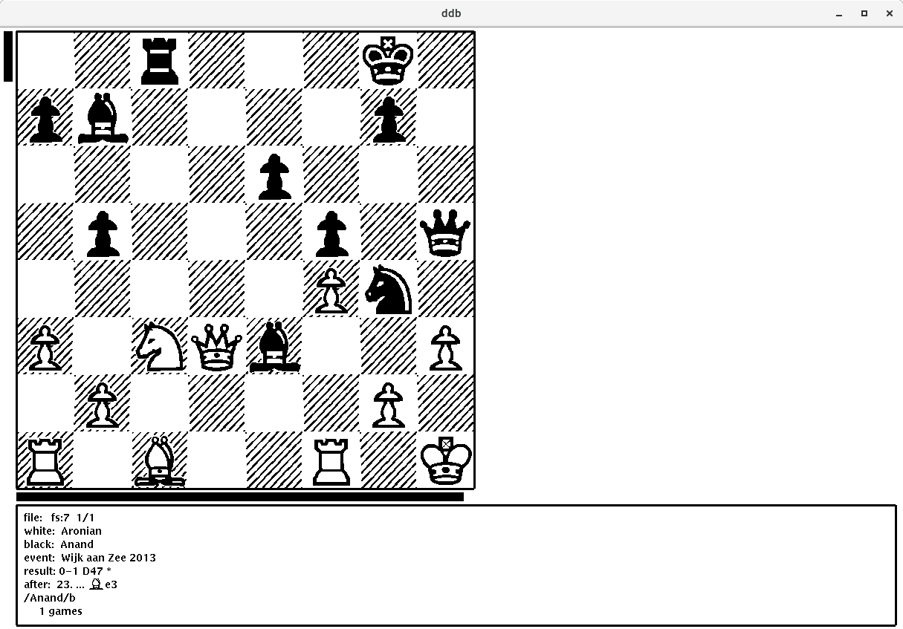

# Chdb

Chdb is a port of the [chess database browser](http://man.cat-v.org/plan_9_2nd_ed/7/chdb) from the 2nd edition of [plan9](https://en.wikipedia.org/wiki/Plan_9_from_Bell_Labs) dated around 1995. Unfortunately the browser was removed from the subsequent editions of the system. Recently i found an old iso image of the 2nd edition at http://9.postnix.pw/hist/2e/ and decided to port the software to Plan 9 from user space (aka plan9port).

## Installation

To build chdb you need to have [plan9port](https://9fans.github.io/plan9port/) properly installed with the PLAN9 environment variable pointing to the installation directory. Then

```
git clone https://github.com/anastasop/chdb
cd chdb
mk all
```

It consists of two programs. The first `o.cdb` reads files in text format and generates a database. You can try it with `./o.cdb games/*`. The resulting m.out is included in the repo for convenience. The second program `o.ddb` is the database browser. Run `./o.ddb m.out` and the browser will start. You should see a window like the following:



## Usage

The manual is in `doc/` in pdf and text formats. Also online [at](http://man.cat-v.org/plan_9_2nd_ed/7/chdb)

## Highlights

The 2nd edition release of chdb was only a prototype and was abandonded later. Compared to modern databases it is not as feature rich but it has some very interesting points especially for programmers to study.

- A parser for a game format similar to [PGN](https://en.wikipedia.org/wiki/Portable_Game_Notation). Supports both textual and binary formats. Check games/ for examples.
- A DSL based on regular expressions for querying the database.
- A graphical board game editor.
- A chessboard move generator and verifier.
- Vector graphics. Pieces are not resizable bitmaps but are drawn with vector graphics and then rendered. An approach similar to [SVG](https://developer.mozilla.org/en-US/docs/Web/SVG).
- An interesting UI where the squares, the rows and the files of the chessboard drive the interaction with the browser.

## Credits

Chdb was written by [Ken Thompson](https://en.wikipedia.org/wiki/Ken_Thompson) for the first and second editions of plan9. Ken is most famous as the creator of UNIX by he is also one of the [pioneers](https://www.chessprogramming.org/Ken_Thompson) of chess programming. He co-created [Belle](https://en.wikipedia.org/wiki/Belle_(chess_machine)), a former chess computer world champion and created the first endgame databases for up to six-pieces.

## License

TDB
